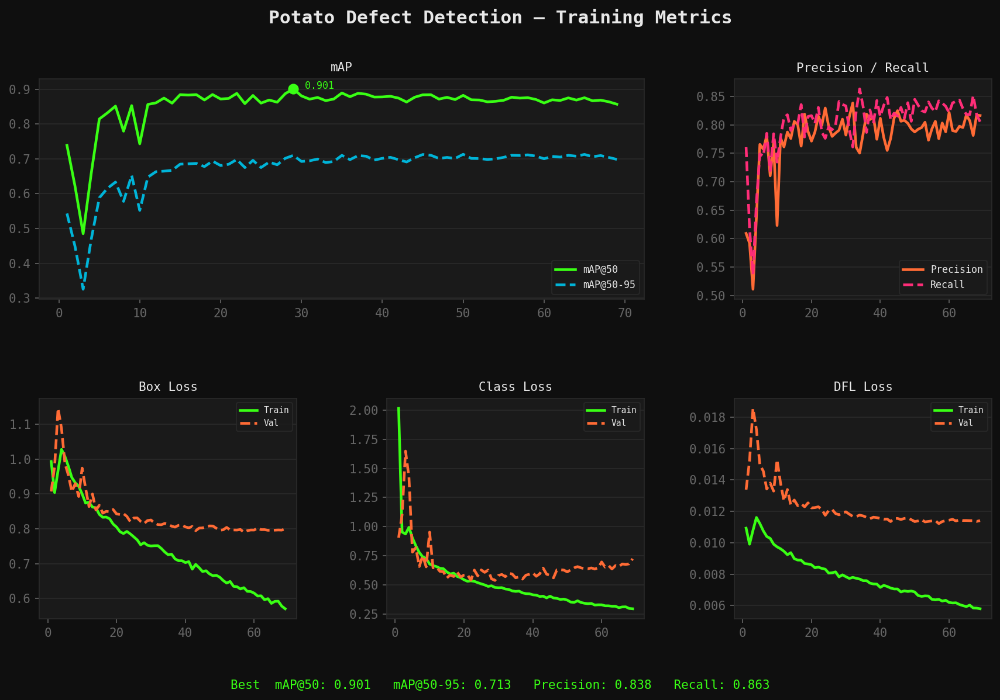

# 🥔 Potato Defect Detection

Real-time potato defect detection on a conveyor belt using a fine-tuned YOLO26m model, ByteTrack tracking, and temporal smoothing. Built end-to-end from dataset collection to live webcam inference.

> **Demo video** 


---

## Results

| Metric | Value |
|--------|-------|
| mAP@50 | **0.901** |
| mAP@50-95 | **0.713** |
| Precision | 0.817 |
| Recall | 0.855 |
| Inference speed | ~3.5ms / frame (RTX 4050) |



---

## Pipeline

```
Raw dataset (Roboflow)
    → Class remapping (5 classes → good / defect)
    → Webcam capture (500 images, real conditions)
    → Semi-automatic annotation (Label Studio + ML backend)
    → Annotation review & correction (custom review tool)
    → Fine-tuning YOLO26m on Google Colab (A100)
    → Real-time inference with ByteTrack + temporal smoothing
```

---


## Setup

```bash
pip install ultralytics flask flask-socketio opencv-python label-studio-ml
```

Download `best.pt` → [Google Drive](https://drive.google.com/file/d/1f2ogY5rqJbxXPzycS5nl8CbNIKWw_m-L/view?usp=sharing)

---

## Usage

### Live webcam inference

```bash
python real_time.py
```

| Key | Action |
|-----|--------|
| `r` | Start / stop recording |
| `q` | Quit |

### Label Studio ML backend

```bash
python run_backend.py
```

Runs on `http://localhost:9090`. Connect it to your Label Studio project for automatic pre-annotation.

### Annotation review tool

```bash
python review_annotations.py
```

| Key | Action |
|-----|--------|
| `g` | Mark box as **good** |
| `d` | Mark box as **defect** |
| `n` | Next box (no change) |
| `s` | Skip image |
| `q` | Save and quit |

---

## Dataset

- **Base dataset**: [Potato Detection — Roboflow Universe](https://universe.roboflow.com/vegetable-quality-detection/potato-detection-3et6q/dataset/11)
- **Original classes**: 5 → remapped to `good` (0) and `defect` (1)
- **Additional data**: 255 images captured with webcam in real conditions, annotated via Label Studio with ML-assisted pre-annotation
- **Train set**: ~7800 images — **Val set**: 576 images

---

## Model

| Parameter | Value |
|-----------|-------|
| Architecture | YOLO26m |
| Parameters | 21.8M |
| Input size | 640×640 |
| Epochs | 69 |
| Batch size | 64 |
| Hardware | A100 40GB (Google Colab) |

---

## Key Design Decisions

**Asymmetric confidence thresholds** — defect requires higher confidence than good (`good: 0.5`, `defect: 0.75`). In an industrial context, missing a defect is more costly than a false positive.

**Temporal smoothing** — majority vote over a sliding window of 15 frames per track ID. Reduces class flickering on ambiguous patches.

**Ghost frames** — last known bounding box is displayed for 8 frames after a track is lost, preventing visual blinking between frames.

---

## Author

Ahmed Khelladi — [LinkedIn](https://www.linkedin.com/in/djalil-khelladi-948560256/) · [GitHub](https://github.com/akhellad)